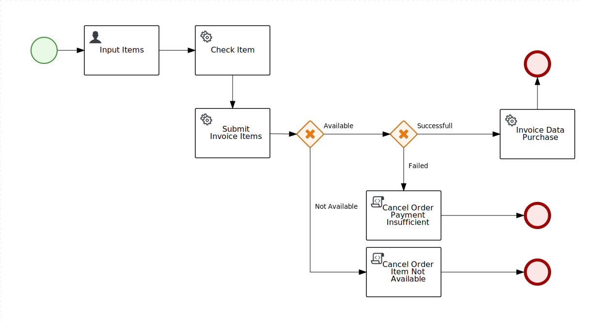

# Quarkus Kafka and Kogito Minimum Viable Product (MVP)

## Index

## Deskripsi

Pada project ini dibuat dengan menggunakan framework Quarkus dan spring-boot kogito. Project ini dibuat untuk mensolusikan dan memperlihatkan penggunaan framework Quarkus dan Kogito. Project ini terbagi atas 3 komponen yaitu Quarkus Kafka producer, Quarkus Kafka consumer, dan Spring-boot Kogito. Berikut ini penjelasan untuk ke-3 komponen:

### Quarkus Kafka Producer

Proses aplikasi merupakan proses penambahan customer baru dengan REST Endpoint. Dimana body payload untuk rest endpoint dapat dilihat pad bagian bawah ini. Nantinya pada aplikasi akan melakukan penyimpan ke database dengan table customer dan table temporary message. Customer yang dimasukan tidak akan berstatus "ACTIVE" atau 1 tetapi akan berstatus 2 atau "INACTIVE". Status customer ini akan berubah menjadi aktif setelah pesan yang dikirim dengan kafka diproses oleh aplikasi Quarkus Kafka Consumer. Temporary message digunakan untuk menyimpan data beserta status pengiriman. Temporary message digunakan untuk mekanisme fail and retry apabila message tidak terkirim ke aplikasi Quarkus Kafka Consumer atau ke kafka broker.

note: untuk fitur mekanisme retry masih belum dikembangkan pada aplikasi dan akan dikembangkan nantinya.

```
{
    "firstName":"kafka",
    "lastName":"quarkus",
    "email":"testing@gmail.com",
    "address":"kemayoran",
    "gender":"laki-laki",
    "dob":"1994-11-11"
}
```

### Quarkus Kafka Consumer

Aplikasi ini adalah aplikasi yang berjalan setalah aplikasi Quarkus Kafka Producer berjalan. Hal ini dikarenakan strategy pada aplikasi Quarkus Kafka Producer diset create and drop berdasarkan defaultnya. Tapi bisa diganti menjadi none atau validate. Pada aplikasi ini nantinya message yang diterima berupa id customer dan id temporary message, yang nantinya akan diubah statusnya menjadi 1 atau "ACTIVE".

### Quarkus Kafka Spring-boot dengan Kogito

Pada [Gambar 1.1](#image1) dibawah ini adalah alur flow data menggunakan BPMN kogito. Dimana pada gambar dibawah ini adalah proses transaksi checkout barang pada market place. Pertama penggunana disini (user) akan menginputkan data pembelanjaan dengan body object JSON dibawah ini sebagai contoh. Pada aplikasi ketika dijalankan terdapat schema dan seed data yang akan diinject langsung ke database postgres. Pada contoh dibawah adalah data yang perlu dimasukan dimana Items merukanan kumpulan data item yang akan dibeli berdasarkan id item dan juga data jumlah. Kemudian juga ada data total pembayaran yang dilakukan oleh user.

```
{
  "catalog": {
    "items": [
      {
        "itemId": Integer,
        "qty": Integer
      }
    ],
    "payment": Double
  }
}
```

Seiring dengan berjalannya flow data melalui process data akhir akan berbentuk berikut dibawah ini/

```
{
  "catalog": {
    "items": [
      {
        "itemId": Integer,
        "qty": Integer
      }
    ],
    "total": Double,
    "payment": Double,
    "avalaible": Boolean
  }
}
```

Untuk alur proses data sebagai berikut:

- Pengguna mengisikan data pembelanjaan item dan jumlah pembayaran.
- Proses check item akan dilakukan untuk mengecek apakah item ada dan jumlahnya mencukupi atau tidak.
- Proses submit invoice disini akan dihitung jumlah total belanjaan sesuai harga pada tabel item dan qty pada data pembelannjaan.
- Kemudian akan dilakukan pengecekan apakah data available atau tidak dari hasil proses cek item. Jika iya akan lanjut ke proses berikutnya kalau tidak ke mengeluarkan log proses dibatalkan dan selesai.
- Kalau data available akan dilakukan pengecekan apakah pembayaran sesuai atauu lebih besar atau tidak. Kalau pembayaran lebih kecil akan dibatalkan dan selesai, kalau sama atau lebih besar lanjut ke proses berikutnya.
- Pada proses trakhir ini akan melakukan penyimpanan pada tabel purchases dan update quantity pada tabel item. Setelah itu proses berakhir untuk 1 flow.

<p id="image1" align="center">
  
  Gambar 1.1 Tampilan flow BPMN checkout kogito
</p>
